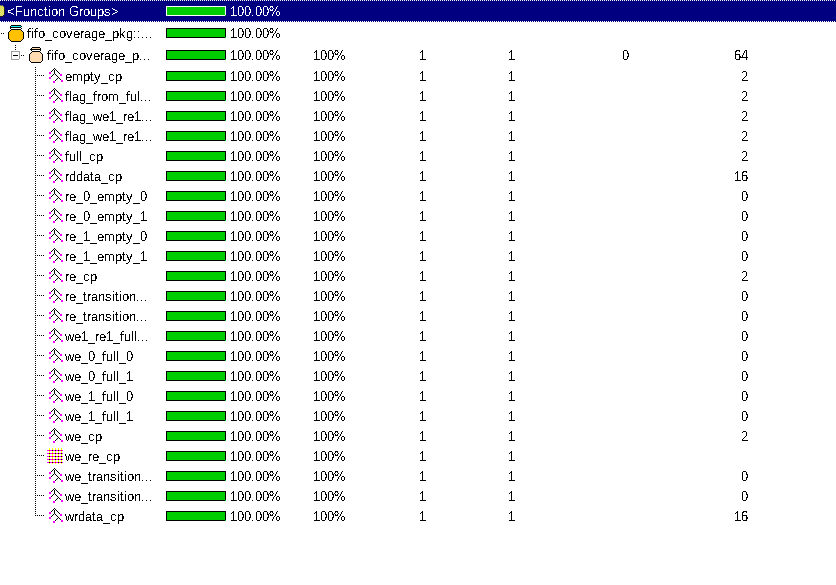

# FIFO Verification
This repository includes all of the files and tests used to verify my existing FIFO module.

## FIFO Module
The verilog FIFO I coded is well documented here:

https://github.com/Aleksander-Stoilov/Verilog-FIFO

The FIFO module is also included in the "rtl" folder here.

## Verification
The FIFO module was verified using the UVM methodology.

This repository includes all components of a UVM test bench:

- agents
  - write agent
      - with all relevant logic (drivers, monitors, sequencers, etc.)
  - read agent
      - with all relevant logic (drivers, monitors, configs, sequencers, etc.)
- environment
- scoreboard
- sequences
- tests
- top/testbench

## Coverage
The FIFO has complete 100% functional coverage. The different cover points can be reviewed in the "coverage" folder.
Here's a screenshot of the coverage statistics: 
